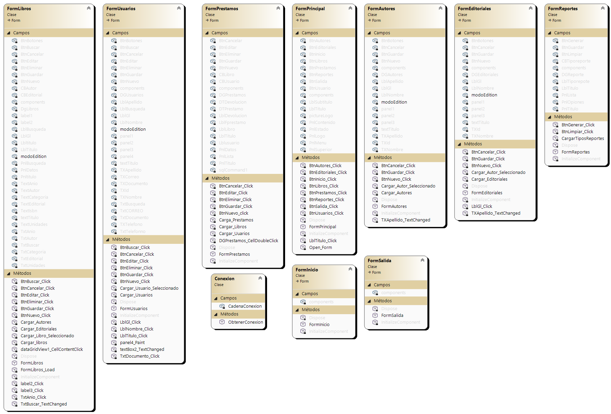
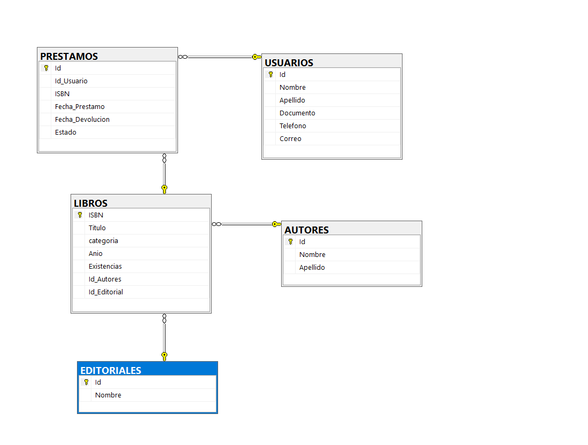
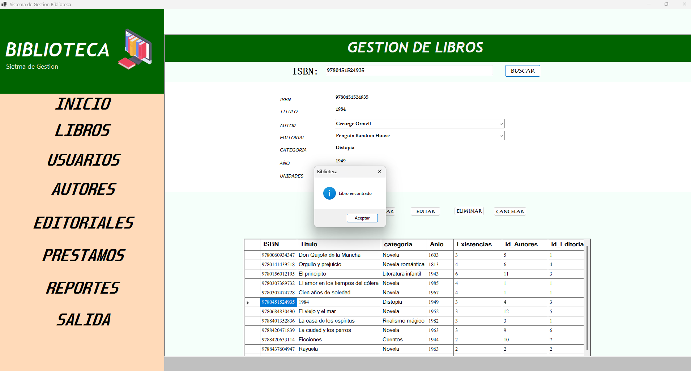
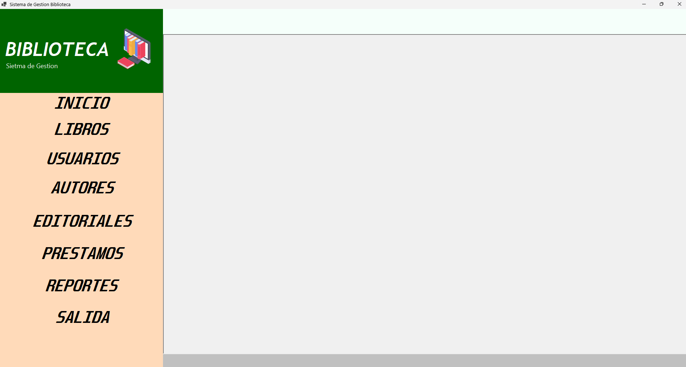
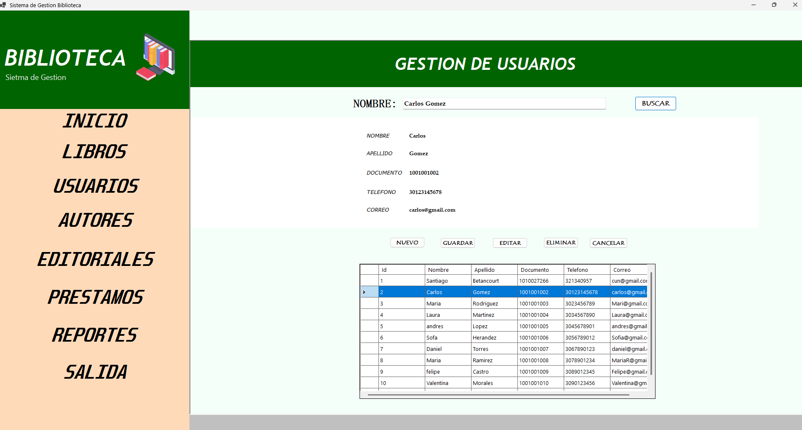
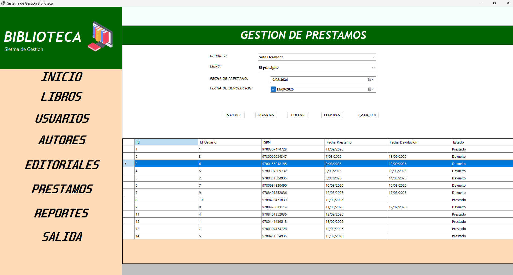

# SwBiblioteca
# PORTADA
**Título del Proyecto:** Sistema de Gestión de Biblioteca  
**Nombre del Estudiante:** Santiago Arturo Betancourt Roa  
**Asignatura:** Programación Avanzada  
**Docente:** Veronica Castro Munar
**Institución:** Coorporacion Unificadad de Educacion Nacional 
**Fecha:**13/09/2026

---

# CONTRAPORTADA
**Proyecto:** Desarrollo de un sistema de escritorio para la administración de una biblioteca utilizando C#, SQL Server y Arquitectura por Capas.  
**Autor:** Santiago Arturo Betancourt Roa    
**Repositorio GitHub:** https://github.com/Santi77-1/SwBiblioteca

---

# TABLA DE CONTENIDO
1. Introducción
2. Objetivos
3. Planteamiento del problema
4. Análisis de requerimientos
5. Casos de uso
6. Diagrama de clases
7. Modelo entidad-relación
8. Diccionario de datos
9. Arquitectura del sistema
10. Explicación de cada módulo desarrollado
11. Capturas de pantalla del sistema
12. Pruebas de funcionamiento
13. Conclusiones
14. Recomendaciones
15. Referencias bibliográficas

---

# 1. INTRODUCCIÓN
El presente proyecto documenta el desarrollo de un sistema de escritorio diseñado para automatizar y administrar los procesos principales de una biblioteca. La aplicación fue desarrollada en el lenguaje C# utilizando el framework Windows Forms para la interfaz gráfica[cite: 1, 2], y SQL Server como motor de base de datos relacional[cite: 1, 3]. El sistema implementa los principios de la Programación Orientada a Objetos (POO) y una arquitectura por capas para separar la presentación, la lógica de negocio y el acceso a datos[cite: 1].

# 2. OBJETIVOS
**Objetivo General:**  
Desarrollar una aplicación de escritorio utilizando C# y SQL Server que permita gestionar los procesos principales de una biblioteca mediante la aplicación de Programación Orientada a Objetos y conexión a bases de datos[cite: 1].

**Objetivos Específicos:**
* Aplicar los principios de Programación Orientada a Objetos[cite: 1].
* Diseñar e implementar una base de datos relacional en SQL Server[cite: 1].
* Implementar operaciones CRUD (Crear, Leer, Actualizar, Eliminar) para los módulos del sistema[cite: 1].
* Implementar una arquitectura por capas[cite: 1].
* Validar la información ingresada por el usuario y manejar excepciones adecuadamente[cite: 1].
* Utilizar Git y GitHub como sistema de control de versiones[cite: 1].

# 3. PLANTEAMIENTO DEL PROBLEMA
Actualmente, una institución educativa realiza toda la administración de su biblioteca de forma manual[cite: 1]. Esta gestión abarca la información de libros, estudiantes, préstamos y devoluciones, lo cual está ocasionando problemas como pérdida de información, errores constantes en los registros y una alta dificultad para consultar el estado real y actualizado de los préstamos[cite: 1]. Para solucionar esto, se requiere un sistema automatizado que organice y centralice dicha información[cite: 1].

# 4. ANÁLISIS DE REQUERIMIENTOS

**Requerimientos Funcionales:**
* **RF01 - Gestión de Libros:** Permitir registrar, consultar, editar, eliminar y buscar libros (por Código/ISBN, Título, Autor, Categoría), además de mostrar su disponibilidad[cite: 1].
* **RF02 - Gestión de Autores:** Permitir registrar autores con su información básica[cite: 1].
* **RF03 - Gestión de Categorías / Editoriales:** Administrar las clasificaciones de los libros[cite: 1].
* **RF04 - Gestión de Usuarios:** Registrar usuarios (estudiantes/lectores) con validación de documento único[cite: 1].
* **RF05 - Gestión de Préstamos:** Registrar préstamos validando que existan unidades disponibles del libro[cite: 1].
* **RF06 - Gestión de Devoluciones:** Registrar devoluciones, actualizando automáticamente el estado del préstamo a "Devuelto" y sumando las existencias del libro[cite: 1, 2].
* **RF07 - Consultas y Reportes:** Generar reportes de préstamos activos, préstamos devueltos e inventario de libros[cite: 1, 2].

**Requerimientos No Funcionales:**
* Interfaz gráfica amigable basada en Windows Forms[cite: 1].
* Validaciones estrictas (ej. no permitir registros duplicados, ISBN único, validación de formatos numéricos para documentos)[cite: 1, 2].
* Manejo de errores mediante bloques `try-catch` para evitar cierres inesperados[cite: 1, 2].
* Código organizado bajo arquitectura por capas[cite: 1].

# 5. CASOS DE USO
1. **Administrar Usuarios:** El bibliotecario puede registrar un nuevo usuario, buscarlo por nombre, editar sus datos o eliminarlo del sistema[cite: 2].
2. **Administrar Inventario:** El bibliotecario puede agregar libros, registrar sus autores y la editorial a la que pertenecen[cite: 2].
3. **Realizar Préstamo:** El bibliotecario selecciona un usuario y un libro. El sistema verifica disponibilidad y registra el préstamo, descontando 1 de la existencia[cite: 2].
4. **Registrar Devolución:** El bibliotecario busca un préstamo activo y lo marca como devuelto, reintegrando el libro al inventario[cite: 2].
5. **Generar Reportes:** El bibliotecario selecciona el tipo de reporte (Préstamos Activos, Devueltos o Inventario) y el sistema muestra los datos en una grilla[cite: 2].

# 6. DIAGRAMA DE CLASES

El sistema se compone de clases de interfaz (`FormPrincipal`, `FormUsuarios`, `FormLibros`, `FormPrestamos`, `FormReportes`, etc.) que heredan de la clase `Form`[cite: 2]. Además, cuenta con la clase `Conexion` ubicada en el espacio de nombres `Biblioteca.Datos` que encapsula la lógica para obtener la conexión a SQL Server[cite: 2].

# 7. MODELO ENTIDAD-RELACIÓN

La base de datos cuenta con las siguientes relaciones principales:
* **LIBROS** tiene una relación de muchos a uno con **AUTORES** (Llave foránea `Id_Autores`) y **EDITORIALES** (Llave foránea `Id_Editorial`)[cite: 3].
* **PRESTAMOS** es una tabla transaccional que une a **USUARIOS** (Llave foránea `Id_Usuario`) y **LIBROS** (Llave foránea `ISBN`) en una relación de muchos a muchos[cite: 3].

# 8. DICCIONARIO DE DATOS
Con base en el script SQL implementado[cite: 3]:

* **Tabla USUARIOS:**
  * `Id` (INT, PK, Identity): Identificador único del usuario.
  * `Nombre` (VARCHAR 100): Nombre del usuario.
  * `Apellido` (VARCHAR 100): Apellido del usuario.
  * `Documento` (VARCHAR 30, Unique): Número de identidad.
  * `Telefono` (VARCHAR 30): Teléfono de contacto.
  * `Correo` (VARCHAR 150): Correo electrónico.

* **Tabla LIBROS:**
  * `ISBN` (VARCHAR 20, PK): Código único del libro.
  * `Titulo` (VARCHAR 200): Título de la obra.
  * `categoria` (VARCHAR 100): Clasificación del libro.
  * `Anio` (INT): Año de publicación.
  * `Existencias` (INT): Cantidad disponible en biblioteca.
  * `Id_Autores` (INT, FK): Referencia al autor.
  * `Id_Editorial` (INT, FK): Referencia a la editorial.

* **Tabla PRESTAMOS:**
  * `Id` (INT, PK, Identity): Identificador del registro.
  * `Id_Usuario` (INT, FK): Referencia al usuario.
  * `ISBN` (VARCHAR 20, FK): Referencia al libro prestado.
  * `Fecha_Prestamo` (DATE): Fecha en que se prestó.
  * `Fecha_Devolucion` (DATE, Nullable): Fecha de retorno.
  * `Estado` (VARCHAR 30): Admite 'Prestado' o 'Devuelto'.

* **Tabla AUTORES:**
  * `Id` (INT, PK, Identity): Identificador del autor.
  * `Nombre` (VARCHAR 100): Nombres.
  * `Apellido` (VARCHAR 100): Apellidos.

* **Tabla EDITORIALES:**
  * `Id` (INT, PK, Identity): Identificador de la editorial.
  * `Nombre` (VARCHAR 150): Nombre de la editorial.

# 9. ARQUITECTURA DEL SISTEMA
El proyecto está construido bajo una **Arquitectura por Capas**[cite: 1, 2]:
1. **Capa de Presentación:** Formularios de Windows Forms (`FormUsuarios.cs`, `FormPrestamos.cs`, etc.) encargados de la interacción directa con el bibliotecario[cite: 2].
2. **Capa de Lógica de Negocio / Acceso a Datos:** Actualmente integrada mediante bloques estructurados. Se utiliza la clase `Conexion` (en la carpeta `Datos`) para instanciar objetos `SqlConnection` y enviar los comandos SQL (`SqlCommand`)[cite: 2]. Las validaciones de negocio, como verificar la existencia de un libro antes de un préstamo, se ejecutan en los eventos de los formularios antes de procesar la transacción en la base de datos[cite: 2].

# 10. EXPLICACIÓN DE CADA MÓDULO DESARROLLADO
* **FormPrincipal:** Funciona como un contenedor MDI (mediante un panel `PnlContenido`) que permite navegar de manera fluida entre los distintos módulos sin abrir múltiples ventanas flotantes[cite: 2].
* **FormUsuarios:** Permite el registro completo de lectores. Incluye validaciones para asegurar que campos numéricos (como Documento y Teléfono) sean enteros, evitando excepciones en tiempo de ejecución. Permite búsquedas concatenando nombre y apellido[cite: 2].
* **FormAutores y FormEditoriales:** Módulos de mantenimiento que alimentan las llaves foráneas de la tabla de Libros[cite: 2].
* **FormPrestamos:** El módulo más complejo. Permite seleccionar un usuario y un libro mediante `ComboBox` alimentados desde la BD[cite: 2]. Al registrar un préstamo, ejecuta un `INSERT` en `PRESTAMOS` y un `UPDATE` en `LIBROS` para descontar la existencia[cite: 2]. Para la devolución, marca el estado como "Devuelto" y restaura la existencia del libro (+1)[cite: 2].
* **FormReportes:** Módulo de consultas especializado que utiliza un `ComboBox` para cambiar el tipo de reporte ("Préstamos Activos", "Préstamos Devueltos", "Inventario") generando consultas `INNER JOIN` dinámicas y mostrando los resultados en un `DataGridView`[cite: 2].

# 11. CAPTURAS DE PANTALLA DEL SISTEMA

* **Pantalla Principal:**

* **Módulo de Registro de Usuarios:**

* **Gestión de Préstamos y Devoluciones:**

# 12. PRUEBAS DE FUNCIONAMIENTO
Se realizaron las siguientes pruebas funcionales y validaciones:
1. **Intento de registro incompleto:** El sistema muestra advertencias mediante `MessageBox` si se intenta guardar un usuario o préstamo con campos vacíos[cite: 2].
2. **Préstamo sin existencias:** El sistema bloquea exitosamente la transacción indicando que "No hay existencias disponibles para el libro seleccionado"[cite: 2].
3. **Devolución duplicada:** Se probó devolver un libro previamente marcado como devuelto; el sistema valida la columna de "Estado" y advierte que ya fue devuelto, evitando sumar erróneamente el stock[cite: 2].

# 13. CONCLUSIONES
* La aplicación estricta de la Programación Orientada a Objetos en C# junto con el uso de Windows Forms facilitó el desarrollo de una interfaz modular, amigable y escalable para la biblioteca.
* El modelo relacional en SQL Server garantizó la integridad de la información gracias al uso de llaves foráneas y restricciones lógicas, solucionando el problema inicial de pérdida de datos.
* El manejo adecuado de excepciones (bloques `try-catch`) asegura que la aplicación se mantenga estable incluso ante fallos de conexión a la base de datos o ingresos de datos atípicos[cite: 2].

# 14. RECOMENDACIONES
* Se recomienda en futuras iteraciones implementar un patrón de diseño como MVC o separar aún más las consultas SQL de los eventos del formulario hacia una capa `DAO` dedicada para mejorar el mantenimiento del código.
* Se sugiere agregar un módulo de "Autenticación de Usuarios" (Login) para tener control sobre qué bibliotecario realiza cada préstamo o devolución.
* Podría ser beneficioso migrar el sistema a la nube o exponer los datos mediante una API REST para que los estudiantes puedan consultar la disponibilidad de los libros desde una página web.

# 15. REFERENCIAS BIBLIOGRÁFICAS
* Microsoft Corporation. (2024). *Documentación oficial de C# y .NET*. Microsoft Learn. Recuperado de https://learn.microsoft.com/es-es/dotnet/csharp/
* Microsoft Corporation. (2024). *Documentación de SQL Server*. Microsoft Learn.
